### I design and ship complete production systems — web, mobile, data, and AI — end to end.

10+ years turning ideas into shipped products. Solo founder &amp; engineer behind a million-line cloud-kitchen platform.

 

---

### 🧩 What I build

- **Full-stack web platforms** — Next.js + NestJS, GraphQL, multi-tenant architecture
- **Cross-platform mobile** — Flutter (Riverpod, GoRouter), PWA, 10-language i18n (RTL)
- **Data &amp; ML / financial analytics** — Python, Pandas, scikit-learn, forecasting &amp; anomaly detection
- **Real-time systems** — WebSockets, Redis pub/sub, live tracking, chat &amp; notifications
- **AI &amp; agentic automation** — Claude / OpenAI / Gemini integrations, autonomous dev workflows
- **DevOps &amp; cloud** — Docker, Nginx, CI/CD (GitHub Actions), Linux, DigitalOcean, multi-region deploys
- **Embedded &amp; IoT** — firmware on microcontrollers (C/C++, Arduino, ESP32, Raspberry Pi), device integration
- **Security** — auth (OAuth, JWT, OTP/MFA, RBAC), AppSec &amp; OWASP, penetration testing, TLS &amp; secrets hardening

### 🛠️ Tech

**Backend**  

**Frontend**  

**Mobile**  

**Data &amp; ML**  

**Data stores**  

**DevOps**  

**Embedded**  

**Security**  

### 🚀 Selected work

**[eatnshred](https://eatnshred.com) — Cloud-Kitchen SaaS Ecosystem**  
Solo-architected a million-line Next.js / NestJS monorepo: 500+ MongoDB models, 169 GraphQL schemas, real-time delivery across own-fleet + marketplace integrations (Talabat, Deliveroo, Noon Food), a full financial-analytics suite, an AI nutritionist, and companion Flutter apps — deployed across 50+ Docker configurations in 2 regions.

**FinSight — Financial Analytics Platform**  
Django 5 / DRF / FastAPI + Pandas: transaction auto-categorization, spending-trend analysis with anomaly detection &amp; regression forecasting, Celery Beat schedules, and real-time alerts via Django Channels.

**Agentic Dev Toolchain**  
64 custom AI agents, 256 skills, and MCP servers powering autonomous development workflows — code generation, QA, and database operations at scale.

### 📈 Currently

Shipping production platforms end to end and pushing on **agentic engineering** — autonomous, AI-driven development workflows.

 

 
 

